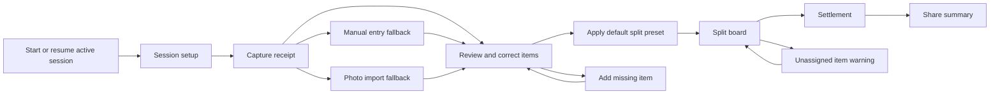

# BillSplitz MVP User Flow

Source: `docs/superpowers/specs/2026-05-04-billsplitz-mvp-design.md`

Primary path:

Screen sequence:

1. Start or Resume
2. Session Setup
3. Capture Receipt
4. Review and Correct
5. Split Board
6. Settlement
7. Share Output

Key product decisions:

- Manual entry is first-class. OCR helps but never blocks the split.
- The MVP should support one active local session before adding history.
- Plain-text sharing is required; image-card sharing is optional polish.
- Settlement must fail visibly when an item is unassigned.
- All math must reconcile to the receipt total after cent rounding.
- Split Board badges must have clear meaning: blue means assigned, green means included in a shared split, and gray means available but not selected.

High-fidelity visual artifact:

`docs/flows/2026-05-22-billsplitz-mvp-user-flow.html`
